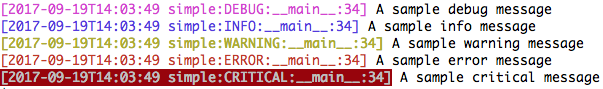

======
prolog
======

Tools and convenience methods to simplify and expedite Python logging.

* Simple - though opinionated - setup for common use-cases
* Extensively and easily configurable via user and local files, as well as environ variables
* Comes with full featured formatters and handlers that can also be used
  in normal ``logging`` situations

Usage
=====

``basic_config``
----------------

The easiest way to begin using ``prolog`` is to add the following to your
application code::

    import prolog
    prolog.basic_config()

will configure the ``root`` logger for the default level ``logging.INFO`` and
set up two handlers: a colorized, console streaming handler, as well as a file
handler set to log to the default file - ``pypro.log`` - in the main app's directory.

To specify select loggers defined in application or library code, you pass the
comma-seperated names of the desired loggers::

    prolog.basic_config('myapp,another_app')

``basic_config`` accepts the following parameters:

``loggers``
    The desired loggers to configure; can be either a comma-separated
    string of logger names, a list of ``Logger`` instances, or ``None``
    for the root logger.

``level``
    Specify the logging level for all loggers and handlers. Can be
    either the numeric value or string name for the desired level.

``handlers``
    The handlers to add to the given ``loggers``; can be a comma-separated
    string of shortcut names ('stream' or 'file', by default) or a list
    of ``Handler`` instances.

``propagate``
    Indicates whether each ``logger`` instance will be set to propagte.

``reset_handlers``
    If True, force a reset of all currently configured handlers.

``cfg``
    The ``prolog.config.PrologConfig`` instance to use. If not given,
    the default will be used (``prolog.config.config``). For all
    preceding parameters except for ``loggers`` set to None (the default),
    ``cfg`` will be used to determine the appropriate setting.

Examples
--------

Once installed, **prolog** can be invoked to show configuration settings or
sample usage.

::

    $ python -m prolog sample --level=DEBUG basic

Develop and testing
===================

::

    $ pip install invoke
    $ inv develop
    $ inv test
